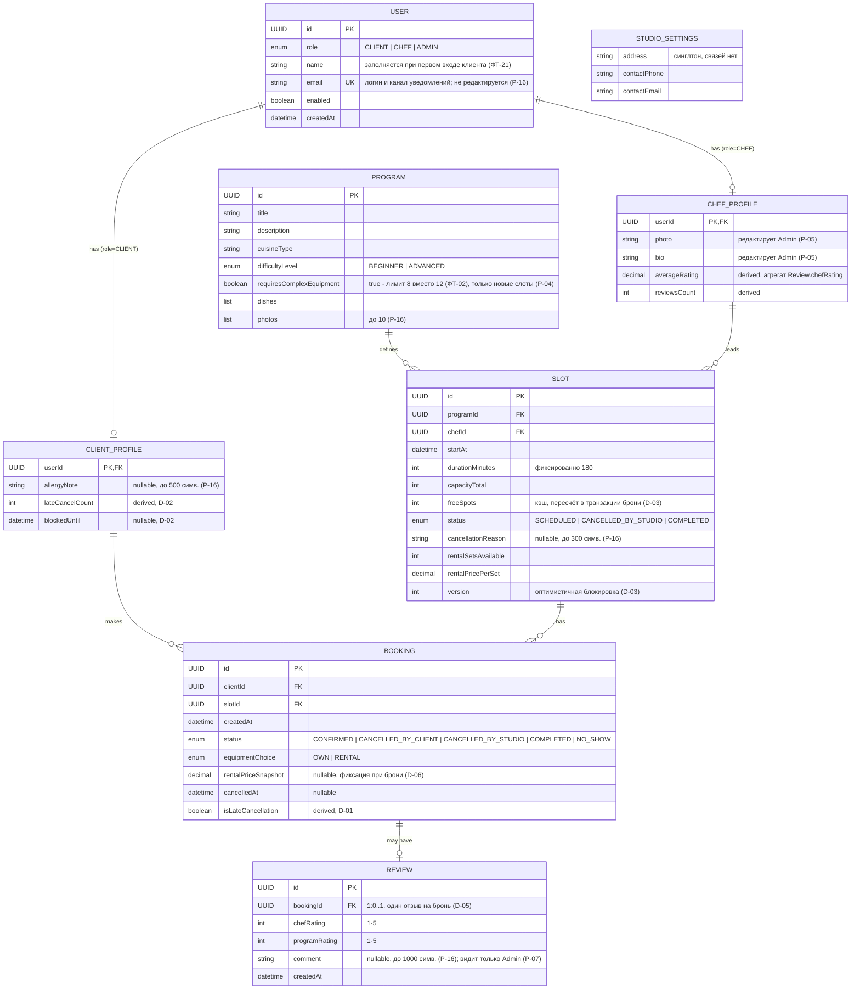

# ER-модель и модели сущностей — «Шеф-стол»

> Источник — [domain-model-cooking.md](../domain/domain-model-cooking.md) и
> [требования](../requirements/requirements-overview-cooking.md). Этот файл не вводит новых
> сущностей и правил — он собирает доменную модель в форму для проектирования БД и API:
> полная ER-диаграмма, описание каждой сущности и матрица доступа «кто читает / кто меняет».
>
> **Про формулировку «какие сущности приходят из бэкенда».** Исходное задание унаследовало её
> из старого скоупа брифа (R-004: мобильный клиент поверх чужого бэкенда). Доменная модель этот
> скоуп отменила — весь стек свой, «чужого» источника данных нет. Эквивалент этой разметки в
> текущем скоупе — [матрица доступа](#матрица-доступа-кто-читает--кто-меняет): для каждой
> сущности видно, какие роли её только читают, а кто (роль или система) меняет.

## ER-диаграмма

Пояснения к диаграмме:

- **Связь «шеф получает отзывы» физического FK не имеет** — рейтинг шефа агрегируется по пути
  `Review → Booking → Slot → ChefProfile`; отдельная ссылка `Review.chefId` не нужна (то же для
  `programRating` — путь `booking → slot → program` уже существует).
- **`StudioSettings` — синглтон без связей**: одна запись на систему, поэтому на диаграмме
  стоит особняком.
- **Код подтверждения входа — сознательно не сущность ER-модели**: короткоживущая запись с TTL
  (10 минут, до 5 попыток — НФТ-04/Р-09), таблица с очисткой по расписанию или кэш; в доменную
  модель и в эту диаграмму не входит.

## Модели сущностей

### User
Базовая учётная запись для всех трёх ролей. Email — одновременно логин (passwordless, ФТ-13)
и канал уведомлений (D-07), поэтому уникален, обязателен и в MVP не редактируется (Р-16).
Аккаунт клиента создаётся молчаливо при первом входе (ФТ-21); аккаунт шефа заводит только
администратор (D-08); пароля нет ни у кого. Поле `name` у клиента заполняется одним вопросом
сразу после первого входа (Р-12).

### ClientProfile
Расширение `User` для роли CLIENT (1:1). Держит заметку об аллергии (ФТ-18, читает её шеф в
списке участников) и дисциплинарную пару `lateCancelCount`/`blockedUntil`: счётчик растёт при
поздней отмене (D-01) и неявке, на 3-м нарушении выставляется блок на 7 дней, по истечении
блок и счётчик сбрасываются автоматически (D-02). Оба поля клиент видит, но не меняет.

### ChefProfile
Расширение `User` для роли CHEF (1:1). Фото и био показываются клиентам в карточке класса,
редактирует их администратор (Р-05/ФТ-25). `averageRating`/`reviewsCount` — производные
агрегаты по `Review.chefRating` (ФТ-12): их не меняет никто из ролей, только система при
создании отзыва. Роль ADMIN отдельного профиля не имеет — полей `User` достаточно.

### StudioSettings
Синглтон с адресом и контактами студии (ФТ-17). Меняет администратор, читают все (адрес —
где проходит класс).

### Program
Единица каталога: что готовим и насколько это сложно. Признак `requiresComplexEquipment`
снижает лимит группы с 12 до 8 (ФТ-02) — и действует только на слоты, созданные после
изменения (Р-04). Создаёт и редактирует только администратор (ФТ-01); архивации в MVP нет
(Р-15) — каталог только растёт.

### Slot
Конкретный класс в расписании: программа + шеф + время. Самая «горячая» сущность — на ней
живут оптимистичная блокировка `version` и кэш `freeSpots`, пересчитываемый в той же
транзакции, что и бронь (D-03, гарантия «0 двойных броней»). Жизненный цикл:
`SCHEDULED → CANCELLED_BY_STUDIO` (только Admin, с обязательной причиной — ФТ-04) или
`SCHEDULED → COMPLETED` (только система, автоматически по `startAt + 180 мин` — D-09).
Редактирования слота нет: исправление = отмена + создание заново (Р-03). При создании
система запрещает пересечение по времени со слотами того же шефа (D-10/ФТ-24).

### Booking
Бронь клиента на слот. Фиксирует выбор экипировки; при `RENTAL` цена проката снимается в
`rentalPriceSnapshot` в момент создания и задним числом не меняется (D-06/НФТ-07). Статусы
меняют разные акторы: `CONFIRMED` — создание клиентом; `CANCELLED_BY_CLIENT` — клиент (с
вычислением `isLateCancellation`, D-01); `CANCELLED_BY_STUDIO` — каскад при отмене слота
администратором (UC-03); `COMPLETED` — система при автозавершении слота (D-09); `NO_SHOW` —
только шеф (ФТ-10), снять ошибочную отметку может только администратор (D-11/ФТ-22).

### Review
Отзыв, привязанный к брони 1:0..1 (один отзыв на бронь, D-05). Создаётся клиентом только по
завершённому классу с неотменённой бронью; после создания не редактируется (клиент видит его
read-only). Публичен только агрегат (рейтинг шефа + число отзывов); текст комментария читает
только администратор (Р-07).

## Матрица доступа: кто читает / кто меняет

Обозначения: **C** — создаёт, **U** — изменяет, **R** — читает, **—** — не имеет доступа.
«Система» — автоматические переходы без действия пользователя (транзакции, планировщик).

| Сущность | Клиент | Шеф | Админ | Система | Комментарий |
|---|---|---|---|---|---|
| User (свой) | R; U только `name` при первом входе | R | C (для шефа, D-08) / R | C (для клиента, ФТ-21) | email никем не редактируется (Р-16) |
| ClientProfile | R; U только `allergyNote` | R (`allergyNote` участников) | R | U (`lateCancelCount`, `blockedUntil` — D-02, D-11) | дисциплинарные поля — только система |
| ChefProfile | R (карточка класса) | R (свой) | C/U (`photo`, `bio` — Р-05) | U (`averageRating`, `reviewsCount`) | агрегаты не меняет никто из ролей |
| StudioSettings | R | R | U (ФТ-17) | — | синглтон |
| Program | R | R | C/U (ФТ-01) | — | для клиента и шефа — только чтение |
| Slot | R | R (свои) | C (ФТ-03); U только отмена (ФТ-04) | U (`freeSpots`/`version` в транзакции брони — D-03; `status → COMPLETED` — D-09) | редактирования нет (Р-03) |
| Booking | C (бронь) / U (отмена своей) / R (свои) | R (брони своих классов); U только `NO_SHOW` (ФТ-10) | R; U только снятие `NO_SHOW` (D-11) и каскад отмены слота | U (`COMPLETED` — D-09; каскад `CANCELLED_BY_STUDIO`) | каждый актор меняет строго свой кусок жизненного цикла |
| Review | C (D-05) / R (свой, read-only) | R только агрегата на профиле | R (включая `comment` — Р-07) | — (агрегат пересчитывает при создании) | текст комментария — только админу |

Итог в терминах исходного задания: **только читают** (read-only для всех ролей UI, меняет лишь
администратор или система) — `Program`, `Slot`, `StudioSettings`, `ChefProfile` с точки зрения
клиента и шефа; **меняют** — `Booking` и `Review` (клиент), `NO_SHOW` в `Booking` (шеф), каталог,
расписание и профили шефов (админ); производные поля (`freeSpots`, `lateCancelCount`,
`blockedUntil`, `averageRating`, статусы `COMPLETED`) не меняет ни одна роль напрямую — только
система по инвариантам D-02/D-03/D-09/D-11.

## Связанные артефакты

- Sequence-диаграмма создания брони с ветками 201/409/410 —
  [sequence-create-booking-cooking.md](sequence-create-booking-cooking.md)
- Реестр экранов — [screen-registry-cooking.md](../design-brief/screen-registry-cooking.md)
- Решения заказчика (Р-01…Р-16) — [design-decisions-cooking.md](../design-brief/design-decisions-cooking.md)
