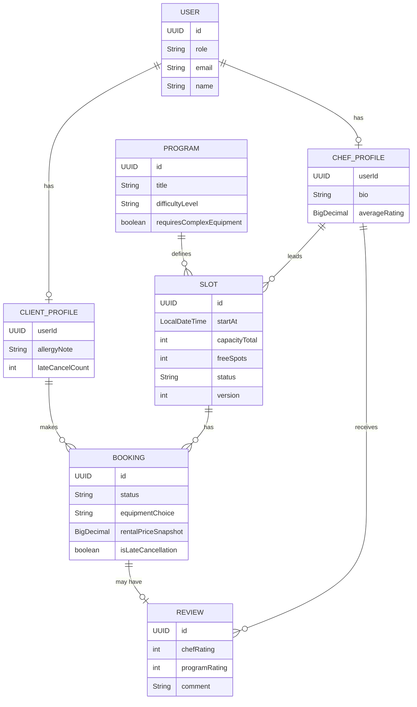

# Доменная модель — «Шеф-стол»

> Основано на `brief-cooking.md` и уточнениях в диалоге с аналитиком.
>
> **Изменение скоупа относительно `brief-cooking.md`.** Исходное уточнение в брифе (R-004, R-028)
> описывало клиентское мобильное приложение поверх уже готового чужого бэкенда — расписание,
> шефы и админка были вне скоупа. В этой версии автор строит весь стек сам: сайт (фронт + бек на
> Spring Boot), без отдельной мобилки. Значит, того "чёрного ящика" больше нет — гарантии, которые
> раньше были "не моей проблемой" (например, 0 двойных броней), теперь нужно обеспечивать в этом же
> приложении. Модель ниже описывает систему целиком, а не только клиентский срез.

## Обзор

Три роли в одном приложении: **клиент**, **шеф**, **администратор** (владелец студии). Общая
идентификация — `User`, с профилем, специфичным для роли.

## Идентификация и роли

### User (базовая сущность аутентификации)

| Поле | Тип | Комментарий |
|---|---|---|
| `id` | `UUID` | |
| `role` | `enum` (`CLIENT`, `CHEF`, `ADMIN`) | |
| `name` | `String` | |
| `email` | `String`, unique, not null | логин для всех трёх ролей |
| `enabled` | `boolean` | |
| `createdAt` | `LocalDateTime` | |

Один способ входа на всех: email + одноразовый код (passwordless), без SMS и без пароля.
Пересмотрено с предыдущей версии — там клиент входил по телефону + SMS, шеф/админ — по
email + пароль. Причина отказа от SMS: email-канал и так обязателен из-за уведомлений (D-07),
а SMS требует отдельного платного шлюза (Twilio, SMS.ru, SMSC.ru) с регистрацией отправителя —
лишняя внешняя зависимость и деньги за то, что можно закрыть уже нужной инфраструктурой.
Заодно один механизм вместо двух означает, что `passwordHash` и flow восстановления пароля
не нужны вообще ни для одной роли.

Код подтверждения (шесть цифр, срок действия, число попыток) — не доменная сущность в смысле
`User`/`Booking`. Короткоживущая запись с TTL (таблица с очисткой по расписанию или кэш), общая
для всех трёх ролей.

### ClientProfile (1:1 → User, role=CLIENT)

| Поле | Тип | Комментарий |
|---|---|---|
| `user` | `User` (ref) | |
| `allergyNote` | `String`, nullable | профиль, не за каждой бронью |
| `lateCancelCount` | `int` | derived, см. D-02 |
| `blockedUntil` | `LocalDateTime`, nullable | до этой даты новые брони заблокированы; см. D-02 |

### ChefProfile (1:1 → User, role=CHEF)

| Поле | Тип | Комментарий |
|---|---|---|
| `user` | `User` (ref) | |
| `photo` | `String` | |
| `bio` | `String` | |
| `averageRating` | `BigDecimal` | derived — агрегат по `Review.chefRating` |
| `reviewsCount` | `int` | derived |

Роль `ADMIN` отдельного профиля не требует — полей `User` достаточно.

### StudioSettings (синглтон, управляется Admin)

| Поле | Тип | Комментарий |
|---|---|---|
| `address` | `String` | адрес студии — раньше приходил из чужого API (R-015), теперь свои данные |
| `contactPhone` | `String` | |
| `contactEmail` | `String` | |

## Каталог (создаётся и редактируется Admin)

### Program (программа/меню класса)

| Поле | Тип | Комментарий |
|---|---|---|
| `id` | `UUID` | |
| `title` | `String` | |
| `description` | `String` | |
| `cuisineType` | `String` | |
| `difficultyLevel` | `enum` (`BEGINNER`, `ADVANCED`) | |
| `requiresComplexEquipment` | `boolean` | если true — лимит класса 8 человек вместо 12 |
| `dishes` | `List<String>` | |
| `photos` | `List<String>` | |

### Slot (слот расписания)

| Поле | Тип | Комментарий |
|---|---|---|
| `id` | `UUID` | |
| `program` | `Program` (ref) | |
| `chef` | `ChefProfile` (ref) | |
| `startAt` | `LocalDateTime` | |
| `durationMinutes` | `int` | фиксировано, 180 |
| `capacityTotal` | `int` | |
| `freeSpots` | `int` | кэш, пересчитывается транзакционно при брони/отмене (см. D-03) |
| `status` | `enum` (`SCHEDULED`, `CANCELLED_BY_STUDIO`, `COMPLETED`) | меняет Admin |
| `cancellationReason` | `String`, nullable | заполняет Admin при `CANCELLED_BY_STUDIO` |
| `rentalSetsAvailable` | `int` | свободный прокатный фонд наборов |
| `rentalPricePerSet` | `BigDecimal` | текущая цена проката |
| `version` | `int` | оптимистичная блокировка (JPA `@Version`), см. D-03 |

## Данные, которые создаёт клиент

### Booking (бронь)

| Поле | Тип | Комментарий |
|---|---|---|
| `id` | `UUID` | |
| `client` | `ClientProfile` (ref) | |
| `slot` | `Slot` (ref) | |
| `createdAt` | `LocalDateTime` | |
| `status` | `enum` (`CONFIRMED`, `CANCELLED_BY_CLIENT`, `CANCELLED_BY_STUDIO`, `COMPLETED`, `NO_SHOW`) | |
| `equipmentChoice` | `enum` (`OWN`, `RENTAL`) | |
| `rentalPriceSnapshot` | `BigDecimal`, nullable | копия `Slot.rentalPricePerSet` на момент брони, если `RENTAL` |
| `cancelledAt` | `LocalDateTime`, nullable | |
| `isLateCancellation` | `boolean` | derived: `slot.startAt - cancelledAt < 6h` (см. D-01) |

`NO_SHOW` проставляет только Chef через свой интерфейс (теперь он у нас в скоупе) — он лично
ведёт класс и видит фактическую явку; Admin этот статус не проставляет.

### Review (отзыв)

| Поле | Тип | Комментарий |
|---|---|---|
| `id` | `UUID` | |
| `booking` | `Booking` (ref, 1:0..1) | |
| `chefRating` | `int` (1–5) | |
| `programRating` | `int` (1–5) | |
| `comment` | `String`, nullable | |
| `createdAt` | `LocalDateTime` | |

`programRating` не требует отдельной ссылки на `Program` — путь `booking → slot → program`
уже существует.

## Бизнес-правила (инварианты)

- **D-01 — порог бесплатной отмены.** Бесплатна, если `slot.startAt - now() >= 6h`. Иначе
  (включая отмену после старта класса) — `isLateCancellation = true`.
- **D-02 — лимит поздних отмен, с периодическим сбросом.** `lateCancelCount` растёт на 1 при
  `isLateCancellation` или `NO_SHOW`. При достижении `lateCancelCount >= 3` система выставляет
  `ClientProfile.blockedUntil = now() + 7 дней` и блокирует новые брони до этой даты. По
  наступлении `blockedUntil` блок снимается и `lateCancelCount` обнуляется до `0`.
- **D-03 — запрет двойной брони, теперь свой.** Раньше это была гарантия чужого бэкенда (R-004),
  теперь её обеспечивает само приложение. Рекомендация: `@Version` на `Slot` (оптимистичная
  блокировка) + пересчёт `freeSpots` внутри той же транзакции, что и вставка `Booking`; при
  конфликте версий — retry или отказ с понятной ошибкой клиенту. Это прямое решение исходной
  проблемы заказчика ("записываю двоих на один стол").
- **D-04 — запрет повторной записи на отменённый слот.** Слот со статусом `CANCELLED_BY_STUDIO`
  недоступен для новой брони.
- **D-05 — момент доступности отзыва.** `Review` можно создать только когда `slot.status = COMPLETED`
  и `booking` не отменена; один отзыв на одну бронь.
- **D-06 — снапшот цены проката.** `Booking.rentalPriceSnapshot` фиксируется при создании брони и
  не пересчитывается задним числом.
- **D-07 — уведомления по email.** Отмена студией и напоминание о предстоящей записи уходят на
  `User.email` — он есть всегда, так как то же поле используется для входа. Момент отправки
  напоминания решён: два напоминания на бронь — за **24 часа** и за **2 часа** до `slot.startAt`
  (было открытым вопросом, закрыто). Ошибка отправки письма не должна блокировать бронь/отмену —
  это best-effort side-effect, а не часть транзакции; сбой одного из двух напоминаний не влияет
  на отправку другого.
- **D-08 — заведение аккаунтов Chef.** Подтверждено: шеф не регистрируется сам — Admin заводит
  `User(role=CHEF)` по email, аналогично тому, как Артём сейчас сам держит список из пяти шефов +
  приглашённых на сезон. Отдельный пароль не нужен — первый вход тот же passwordless email-код.

## Вне скоупа MVP

- Реальная онлайн-оплата (нал/перевод, без сущности в приложении).
- Программа лояльности / отметки постоянных клиентов.
- Web Push / мобильные уведомления — выбран email как канал MVP.

## Открытые вопросы

Все прежние открытые вопросы сняты решениями: сброс `lateCancelCount` — периодический через
`blockedUntil` (см. D-02); `NO_SHOW` подтверждает только Chef (см. раздел про Booking); момент
отправки email-напоминания — за 24 часа и за 2 часа до `slot.startAt` (см. D-07). На момент этой
версии открытых вопросов не осталось.

## Просмотр расписания клиентом (восстановлено из брифа, R-027)

> **Исправление.** Ранее R-027 брифа был по ошибке сгруппирован с R-004/R-015/R-028 как
> «снято сменой скоупа» (см. `requirements-overview-cooking.md`). Это неточно: R-004/R-015/R-028 —
> про архитектуру (чужой бэкенд-«чёрный ящик» vs свой стек), а R-027 — самостоятельное клиентское
> UX-правило о выдаче расписания, не зависящее от того, кто владеет бэкендом. Восстановлено
> отдельным пунктом ниже, без D-номера — это не инвариант, критичный для базового сценария брони,
> а поведение по умолчанию при просмотре расписания.

Клиенту по умолчанию показываются `Slot` на ближайшие 7 дней от текущего момента — совпадает
с горизонтом планирования расписания («на неделю вперёд», исходный бриф). Более длинный период
доступен через фильтр по датам. Если на ближайшие 7 дней нет ни одного слота — клиент видит
понятный empty state («Пока нет доступных классов»).
